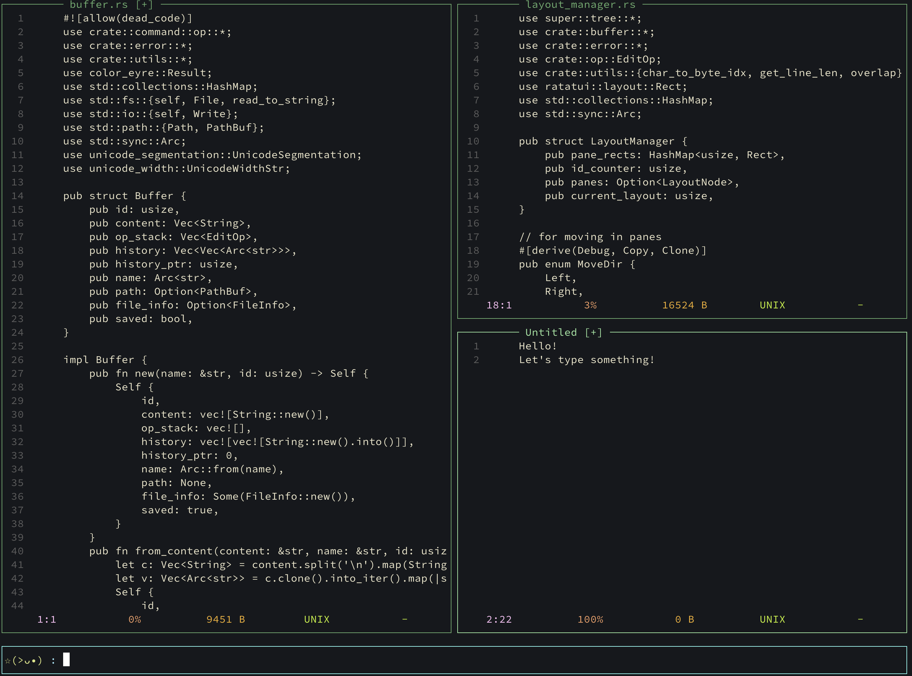

# Smile

A lightweight, terminal-based text editor with TUI written in Rust.

## Basic Operations

`Ctrl-q`: quit
`Ctrl-a`: move to the head of current line
`Ctrl-e`: move to the end of current line
`Ctrl-v`: revoke operation

## Basic Commands
`new buffer`: create a new buffer
`sv`: create a pane vertically
`sh`: create a pane horizontally
`nbp:<path>`: open a file as a new buffer  

W.I.P
